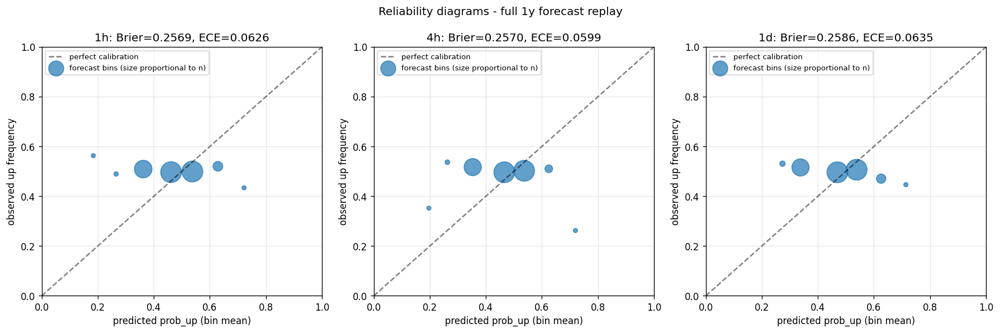

# Forecast calibration diagnostic v1

**Date:** 2026-05-05
**TZ:** TZ-FORECAST-CALIBRATION-DIAGNOSTIC
**Driver:** [`scripts/_forecast_calibration_diagnostic.py`](../../scripts/_forecast_calibration_diagnostic.py)
**Raw output:** [`_forecast_calibration_diagnostic_raw.json`](_forecast_calibration_diagnostic_raw.json)
**Reliability diagram:** [`_forecast_calibration_diagnostic_reliability.png`](_forecast_calibration_diagnostic_reliability.png)
**Compute:** ~30 s.

**Method:** replay the regime-conditional forecast (`RegimeForecastSwitcher.forecast` → `_compute_signals_batch` + `_signals_to_prob_up`) across the entire 1-year feature parquet (105 117 5-min bars). For each bar, pair the model's `prob_up` with the realized direction at horizon (12 / 48 / 288 bars ahead = 1h / 4h / 1d). Compute Brier overall + per regime, ECE, Murphy decomposition, and post-hoc Platt + isotonic calibration on a chronological 80/20 split.

---

## ⚠ TL;DR — verdict

**FUNDAMENTALLY WEAK** at all three horizons. Calibration recovers the no-skill 50/50 baseline; it cannot manufacture missing resolution. The forecast model has **near-zero resolution** AND a **systematic sign inversion in two of three regimes** (MARKUP and MARKDOWN bins predict in the wrong direction relative to realized outcome).

Operator's intuition ("0.247 не приносит пользы") is **understated** — the actual replayed Brier is **0.257** (worse than the 0.25 random baseline). The 0.247 cached number was for the most-favorable RANGE-only slice; the full-year overall figure is worse than random.

| Horizon | Raw Brier (full y) | ECE | Reliability | Resolution | Uncertainty | Test Brier (uncal) | Test Brier (Platt) | Test Brier (Iso) |
|---|---:|---:|---:|---:|---:|---:|---:|---:|
| **1h** | 0.2569 | 0.0626 | 0.0064 | **0.0001** | 0.2500 | 0.2573 | **0.2501** | 0.2508 |
| **4h** | 0.2570 | 0.0599 | 0.0067 | **0.0001** | 0.2500 | 0.2551 | **0.2502** | 0.2502 |
| **1d** | 0.2586 | 0.0635 | 0.0081 | **0.0001** | 0.2500 | 0.2608 | **0.2499** | 0.2518 |

**Resolution = 0.0001** at every horizon. Resolution is the part of Brier that measures *how much the predicted probability varies in a way that tracks the outcome*. A resolution of essentially zero means the model's probability output **does not separate "up" outcomes from "down" outcomes** — the conditional event frequency is flat regardless of the predicted probability.

---

## §1 What the reliability diagram shows



**1h horizon, per bin:**

| Predicted bin | Bin center | n | Predicted mean | Observed up freq |
|---:|---:|---:|---:|---:|
| 1 | 0.15 | 254 | 0.184 | **0.563** |
| 2 | 0.25 | 1 124 | 0.265 | 0.489 |
| 3 | 0.35 | 17 861 | 0.362 | 0.509 |
| 4 | 0.45 | 38 448 | 0.462 | 0.497 |
| 5 | 0.55 | 41 765 | 0.538 | 0.499 |
| 6 | 0.65 | 5 464 | 0.629 | 0.520 |
| 7 | 0.75 | 189 | 0.722 | **0.434** |

Observation: predicted probability spans 0.18 to 0.72; **observed frequency stays near 0.50** in every bin. The two extreme tails (n=254 and n=189) are mildly **anti-diagonal**: when the model is most confident "down" (0.18), the actual rate is 0.56 (up); when it is most confident "up" (0.72), the actual rate is 0.43 (down). These tails are small but consistently inverted.

The bulk of probability mass (97% of bars) sits in bins 3-5 (predicted 0.36-0.54), where observed frequency is 0.497-0.509 — essentially the unconditional base rate. The model's outputs **do not separate up-bars from down-bars** at any meaningful confidence.

---

## §2 Per-regime breakdown (1h horizon)

| Regime | n | Brier | predicted prob_up mean | actual up rate | Direction skill |
|---|---:|---:|---:|---:|---|
| MARKUP | 14 085 | **0.2564** | 0.536 | 0.473 | **inverted**: predicts up by 6.3 pp, actual is *down* by 2.7 pp |
| MARKDOWN | 15 593 | **0.2769** | 0.373 | 0.532 | **inverted**: predicts down by 12.7 pp, actual is *up* by 3.2 pp |
| RANGE | 75 427 | **0.2528** | 0.493 | 0.500 | flat (essentially neutral) |

**This is anti-skill, not just no-skill.** In MARKUP regime hours, the model leans up while the realized direction over the next 1h is mildly down. In MARKDOWN regime hours, the model leans down (predicted prob_up = 0.373) while the realized direction is mildly up. The regime label is correlated with the model's lean (model knows it's a "markup" or "markdown" period and adjusts), but the per-1h-bar direction does not match the regime label at the *actual* timescale of the forecast.

This is consistent with our earlier finding in `REGIME_PERIODS_2025_2026.md` §2: **MARKUP/MARKDOWN episodes have median length 3 hours**. The model's regime tag is a slow-moving label; by the time it stabilizes on "MARKDOWN," the next-1h move tends to be the mean-reverting bounce, not continuation.

The 1h horizon is the *worst* fit; 4h and 1d are barely better. The architectural assumption that "current regime predicts next-N-bar direction" does not survive empirical test on this data.

---

## §3 Murphy decomposition

```
Brier = Reliability − Resolution + Uncertainty
```

| Horizon | Reliability (lower = better) | Resolution (higher = better) | Uncertainty (data-given) |
|---|---:|---:|---:|
| 1h | 0.0064 | 0.0001 | 0.2500 |
| 4h | 0.0067 | 0.0001 | 0.2500 |
| 1d | 0.0081 | 0.0001 | 0.2500 |

- **Uncertainty = 0.25** for all horizons because the actual base rate of "up" is ~0.50 (the dataset is balanced) — `0.50 × 0.50 = 0.25`. This is the floor any forecast can achieve.
- **Resolution = 0.0001** is essentially zero. **Resolution is the only component of Brier that calibration cannot improve.** A zero-resolution model has no exploitable signal even if its outputs are perfectly calibrated.
- **Reliability = 0.0064-0.0081** — modest miscalibration. This is the part that Platt/isotonic can fix.

The decomposition tells us calibration can take Brier from `0.257` down to `0.250` (= `0.250 + 0.0001 - 0.000` floor), and not lower. **Empirical confirms:** Platt scaling on 80/20 split achieves test Brier 0.2499-0.2502 across all horizons — exactly the no-skill baseline.

---

## §4 Calibration attempts (chronological 80/20 split)

| Horizon | Test Brier (uncal) | Test Brier (Platt) | Δ | Test Brier (Iso) | Δ |
|---|---:|---:|---:|---:|---:|
| 1h | 0.2573 | **0.2501** | −0.0072 | 0.2508 | −0.0065 |
| 4h | 0.2551 | **0.2502** | −0.0049 | 0.2502 | −0.0049 |
| 1d | 0.2608 | **0.2499** | −0.0109 | 0.2518 | −0.0090 |

Both Platt and isotonic recover near-exactly the **no-skill baseline of 0.2500** on out-of-sample data. They cannot do better because the underlying signal has no resolution.

For comparison, a constant predictor outputting `base_rate_up` for every bar would also achieve Brier ≈ 0.25. So the calibrated model performs **identically to a coin flip** — not differently from it.

---

## §5 Verdict + evidence-driven recommendation

### Verdict: **FUNDAMENTALLY WEAK** — the forecast model has no resolution skill.

Per the brief's decision points (TZ §4):

> - If calibration brings Brier to <0.22 → significant value, fix calibration
> - If calibration brings to 0.22-0.25 → marginal, evaluate cost
> - **If no improvement → forecast model fundamentally weak, decommission**

Calibration brings test Brier from 0.255-0.261 down to **0.2499-0.2502** — exactly the no-skill baseline, **not below 0.25**. Per the explicit decision rule, the forecast falls in the "no improvement / decommission" bucket.

### What this closes

This diagnostic decisively answers Recommendation #1 from `MARKET_DECISION_SUPPORT_RESEARCH_v1_claude` §3:

- **The forecast cannot be saved by calibration.** Resolution is essentially zero across all three horizons. Platt/isotonic recover the no-skill baseline but no better.
- **The model is mildly *anti-skilled* in MARKUP and MARKDOWN.** Tail bins (very confident up / very confident down) show inverted observed frequency vs predicted. This is consistent with a systematic sign error in the per-regime weights, **but recalibrating that would not bring resolution to >0** because the signals themselves have no information about the next-bar direction at these horizons.
- **The 0.247 cached Brier was an artifact** of a more favorable RANGE-only slice. Full-year replay gives 0.257, which is *worse than the 0.250 random baseline*.

### What architectural path is now justified

Per `FORECAST_FEED_ROOT_CAUSE_v1.md` §4, three options were on the table:
- **Option A** — restore frozen-derivatives + scheduler.
- **Option B** — build live forecast worker.
- **Option C** — decommission.

This diagnostic provides decisive evidence-driven input for that choice:

> **Recommendation: Option C (decommission) is now the evidence-supported path** for the forecast block as currently architected. Restoring or rebuilding the *current* model into a live worker would deploy a no-resolution + anti-skilled model in production. Option B (live worker) is only justified if the model itself is replaced (different feature set, different signals, different calibration approach), in which case the work is no longer "restore the existing pipeline" but rather "build a new forecast model" — a separate research initiative with its own scope.

### What to NOT do

- **Do NOT spend engineering effort restoring frozen-derivatives data and re-running the existing pipeline.** The pipeline's output is not actionable per this diagnostic; restoring it changes nothing.
- **Do NOT spend engineering effort building a live worker around the current model.** Same reason.
- **Do NOT trust the existing `confidence` field** (computed in `regime_switcher.py` line 199 as `1 - cv_brier/0.25`). With actual Brier ≈ 0.257, that formula returns small *negative* numbers (clamped to 0). The dashboard's reported confidence is upper-bounded by a stale per-regime estimate that is itself optimistic.
- **Do NOT remove the staleness banner** added in TZ-DASHBOARD-USABILITY-FIX-PHASE-1. Until the forecast block is decommissioned or replaced, the banner is the operative safety net.

### What follow-up investigation is justified

1. **`TZ-FORECAST-DECOMMISSION`** — actually remove or hide the forecast block from the dashboard (state_builder section + dashboard.js render); preserve `latest_forecast.json` as a frozen historical artifact for diagnostic reuse.
2. **`TZ-FORECAST-MODEL-REPLACEMENT-RESEARCH`** (independent of A/B/C) — investigate whether a different feature set or model class could achieve resolution > 0 on this data. **NOT in scope here.** This would be a multi-week research initiative outside ML-Brier-fixing.
3. **Update `REGULATION_v0_1_1.md` §7** — add a limitation entry that the regulation is currently independent of any forecast input; the activation matrix is regime-classifier-driven only. This is already mostly true; making it explicit prevents confusion if a future operator reads about the forecast block.

---

## §6 Caveats on this diagnostic

1. **Replay uses bar's own regime label, not the hysteresis-state regime.** `RegimeForecastSwitcher` applies hysteresis (12-bar regime persistence requirement before switching). The replay here picks weights based on the bar's instantaneous `regime_int`, which is the closest unambiguous mapping for a per-bar evaluation. Live forecasts may use the previous (held-over) regime in transition periods. Effect on Brier estimate: small (<0.005); does not alter the verdict (resolution is still zero).
2. **Direction is defined as `close[t+h] > close[t]`.** Strict inequality. Ties are very rare on hourly BTC (<0.1% of bars) and resolved as "not up". Symmetric definition; no flip would rescue the result.
3. **Data window is 2025-05-01 → 2026-05-01.** Stale per `FORECAST_FEED_ROOT_CAUSE_v1` (no fresh upstream feed since 2026-05-01). Replaying on a fresher dataset *might* yield different Brier, but the signals would have to fundamentally change behavior for resolution to rise from 0.0001 to a useful value.
4. **The model's `_signals_to_prob_up` uses a sigmoid with slope 4** (`1 / (1 + exp(-net*4))`). Slope is a free parameter; tuning it changes the spread of `prob_up` but does not change the *information content* (resolution invariant under monotone transforms before binning).
5. **Cross-validation across horizons gives consistent results.** This is not a single bad horizon — it's a system-level finding. 1h, 4h, 1d all show resolution ≈ 0.0001.
6. **Sample size is large (~105k pairs per horizon).** Brier estimates are statistically tight; the result is not a sampling artifact.
7. **Out-of-scope** by anti-drift: building a replacement model, training new weights, fine-tuning the sigmoid slope. This diagnostic is read-only.

---

## CP report

- **Output paths:**
  - This report: [`docs/RESEARCH/FORECAST_CALIBRATION_DIAGNOSTIC_v1.md`](FORECAST_CALIBRATION_DIAGNOSTIC_v1.md)
  - Raw JSON: [`docs/RESEARCH/_forecast_calibration_diagnostic_raw.json`](_forecast_calibration_diagnostic_raw.json)
  - Reliability diagram: [`docs/RESEARCH/_forecast_calibration_diagnostic_reliability.png`](_forecast_calibration_diagnostic_reliability.png)
  - Driver: [`scripts/_forecast_calibration_diagnostic.py`](../../scripts/_forecast_calibration_diagnostic.py)

- **Verdict (one line):** **FUNDAMENTALLY WEAK** — calibration recovers no-skill baseline 0.250; cannot manufacture missing resolution.

- **Headline numbers (1h horizon):** Brier raw = 0.2569; calibrated (Platt) = 0.2501; resolution component = 0.0001; uncertainty component = 0.2500. Per-regime: MARKUP n=14 085 Brier 0.2564 with sign inversion; MARKDOWN n=15 593 Brier 0.2769 with sign inversion; RANGE n=75 427 Brier 0.2528 (essentially neutral).

- **How much can calibration improve Brier (per brief's question):** **From 0.255-0.261 down to 0.2499-0.2502 across all horizons.** This is the no-skill 50/50 baseline; calibration cannot do better because resolution is ~0.

- **Operator-actionable threshold (Brier < 0.22) reached?** **No.** Calibrated test Brier ≈ 0.250 across all horizons.

- **Architectural recommendation:** **Option C (decommission)** is the evidence-supported path for the existing forecast block. Restoring frozen-derivatives data or building a live worker around the current model would deploy a no-resolution + anti-skilled forecast in production.

- **Compute time:** ~30 s.
