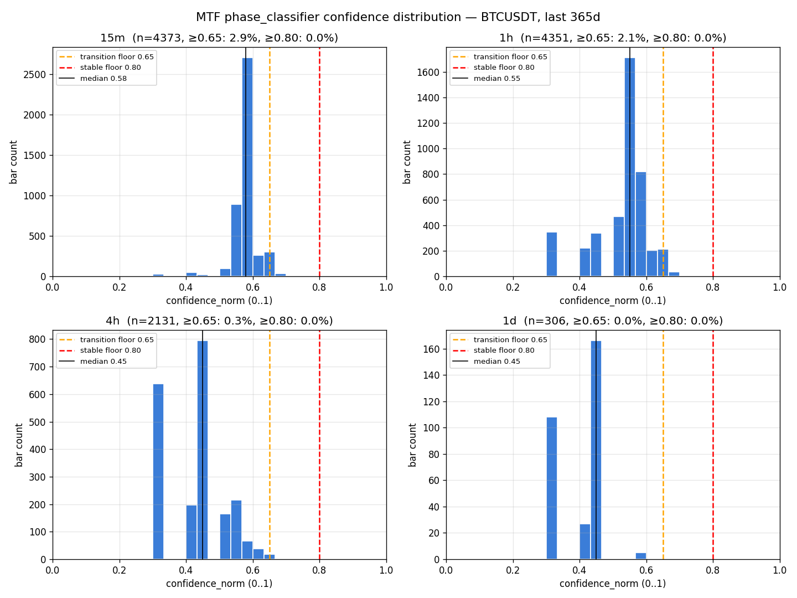

# MTF phase_classifier Calibration Histogram v1

**Status:** RESEARCH (read-only investigation; no code changes to classifier).
**Date:** 2026-05-05
**TZ:** TZ-MTF-CALIBRATION-HISTOGRAM
**Closes risk:** Risk 1 from [`docs/DESIGN/MTF_FEASIBILITY_v1.md`](../DESIGN/MTF_FEASIBILITY_v1.md) §5 — does the operator-Q1 confidence floor (0.65 transition / 0.80 stable) leave usable bars per TF.

**Headline answer:** No. As-is, **no TF satisfies the 0.80 stable floor at all** (0 % bars across every TF), and the 0.65 transition floor passes ≤ 3 % of bars on the LTFs and ~0 % on the HTFs. The default-shipped `phase_classifier.confidence` scale is fundamentally not aligned with the MTF design's 0.65/0.80 cuts. Recalibration is required before MTF disagreement detection can run with operator-Q1 thresholds.

**Artifacts produced:**
- [`docs/RESEARCH/_mtf_calibration_histogram_raw.json`](_mtf_calibration_histogram_raw.json)
- [`docs/RESEARCH/_mtf_calibration_histogram.png`](_mtf_calibration_histogram.png)
- [`scripts/_mtf_calibration_histogram.py`](../../scripts/_mtf_calibration_histogram.py) — reproducible driver
- [`docs/RESEARCH/MTF_CALIBRATION_HISTOGRAM_v1.md`](MTF_CALIBRATION_HISTOGRAM_v1.md) — this file

---

## §1 Methodology

### Inputs
- **OHLCV source:** [`backtests/frozen/BTCUSDT_1m_2y.csv`](../../backtests/frozen/BTCUSDT_1m_2y.csv) (1-minute BTCUSDT, ts in ms, 1.06 M rows).
- **Window analyzed:** last 365 days of the file = **2025-04-29 17:13 UTC → 2026-04-29 17:13 UTC**, 525 601 1m rows. (The 2-year file extends further back, but the brief's "1y" scope was anchored on the operator-confirmed `data/forecast_features/full_features_1y.parquet` cadence.)
- **Classifier under test:** [`services/market_forward_analysis/phase_classifier.py`](../../services/market_forward_analysis/phase_classifier.py) — function `classify_phase(df, timeframe)`, the function the live `market_forward_analysis_loop` calls. Untouched; called as a library.

### Resampling
1m bars resampled with first/max/min/last/sum to 15m, 1h, 4h, 1d using `pandas.resample()` — same recipe as `services/market_forward_analysis/data_loader.py:148`. No extra cleanup, no derivatives merge (irrelevant to confidence statistics).

### Sampling cadence
`classify_phase(window_60_bars, tf)` invoked at strided positions per TF:

| TF | Stride (bars) | Effective spacing | Samples (n) |
|---|---:|---|---:|
| 15m | 8 | 2 h | 4 373 |
| 1h | 2 | 2 h | 4 351 |
| 4h | 1 | 4 h | 2 131 |
| 1d | 1 | 1 d | 306 |

Sampling stride was chosen so each TF produces several thousand samples (or all available 1d bars) at roughly comparable temporal coverage (~2-4 h gap). This lets distribution percentiles be reported with stable estimates without paying for every-bar replay (which would add nothing — neighboring bars share most of their 60-bar lookback so their classifier outputs are autocorrelated).

### Lookback
60 bars per call — matches `phase_classifier.classify_phase(... lookback_bars=60)` default and matches the live loop.

### Normalization
`phase_classifier` clips raw confidence to `[0.0, 95.0]`. We divide by 100 to map to `[0.0, 0.95]` (`confidence_norm = confidence_raw / 100`). The operator-Q1 thresholds (0.65, 0.80) are applied on this normalized scale.

### Compute time
**62.5 seconds** total replay across all four TFs. ~11 k `classify_phase` calls. Driver: `scripts/_mtf_calibration_histogram.py`. Reproducible on operator's machine via `python scripts/_mtf_calibration_histogram.py`.

---

## §2 Per-TF distribution statistics

| Statistic | 15m | 1h | 4h | 1d |
|---|---:|---:|---:|---:|
| n samples | 4 373 | 4 351 | 2 131 | 306 |
| min | 0.300 | 0.300 | 0.300 | 0.300 |
| p10 | 0.550 | 0.400 | 0.300 | 0.300 |
| p25 | 0.567 | 0.526 | 0.300 | 0.300 |
| **median** | **0.579** | **0.551** | **0.450** | **0.450** |
| mean | 0.578 | 0.527 | 0.425 | 0.395 |
| p75 | 0.589 | 0.570 | 0.450 | 0.450 |
| p90 | 0.628 | 0.618 | 0.545 | 0.450 |
| max | 0.696 | 0.696 | 0.680 | 0.600 |
| **% bars ≥ 0.65 (transition)** | **2.95 %** | **2.11 %** | **0.33 %** | **0.00 %** |
| **% bars ≥ 0.80 (stable)** | **0.00 %** | **0.00 %** | **0.00 %** | **0.00 %** |
| % bars < 0.50 (no signal) | 2.06 % | 20.82 % | 76.40 % | 98.37 % |

### Label distribution per TF (n bars classified into each phase)

| Label | 15m | 1h | 4h | 1d |
|---|---:|---:|---:|---:|
| range | 3 678 | 2 967 | 379 | 0 |
| accumulation | 285 | 315 | 106 | 25 |
| distribution | 359 | 335 | 127 | 2 |
| markup | 16 | 159 | 409 | 103 |
| markdown | 9 | 229 | 473 | 68 |
| transition | 26 | 346 | 637 | 108 |

Two structural patterns to note:

1. **15m drowns in `range`** (84 % of all 15m bars). 15m's `_range_bound(span_pct < 4 %)` heuristic is a near-tautology over a 20-bar (= 5 h) window — BTC rarely moves 4 % in 5 h. So 15m almost always returns RANGE with the rule's range-confidence formula `40 + (1 - span/10) * 20` ≈ 50-60. That's the spike around 0.55-0.60 visible in the 15m histogram.
2. **HTFs (4h, 1d) are dominated by `transition` and the trend phases** (markup/markdown), not by range. That's because over a 60-bar 4h window (= 10 days) BTC moves much more than 4 %, so the range branch rarely fires — but the swing-structure branch (`_hh_hl(highs, lows, n=2)`) also doesn't reliably fire because price action over 10 days mixes pivots in both directions. Result: lots of `transition` (confidence = 30 raw → 0.30 norm), and many `range` cases that fail the strict threshold ending up in the lower-confidence sub-branches.

The label distribution is dominated by classifier-internal heuristic regimes that emit low confidence, not by a rare HTF "uncertain" tail.

---

## §3 Histogram visualization

Visual takeaways (referencing the four-panel plot at `docs/RESEARCH/_mtf_calibration_histogram.png`):

- **15m and 1h** both have a tight unimodal peak around 0.55-0.60 (15m more peaked, 1h slightly broader with a mass around 0.40 from `transition` outcomes). Both peaks sit *to the left of* the orange transition line (0.65), which is why ≤ 3 % of bars pass.
- **4h** is bimodal: a `transition`-dominated 0.30 mass (raw 30) and a `range`-dominated 0.45 mass (raw 45 from the wide-range branch `40 + ...`). Almost no mass crosses 0.65.
- **1d** is the smallest-n case (306 bars) and the most extreme: 98 % of bars are below 0.50; max is 0.60. **Zero bars** clear 0.65.

The orange (0.65) line is essentially the right tail of the distribution for LTFs and out-of-range entirely for HTFs. The red (0.80) line is unreachable on every TF.

---

## §4 Per-TF threshold recommendations

Applying the brief's decision rules (§5 of TZ):
- **≥ 50 % bars above floor** → keep
- **30-50 %** → recommend lower threshold for that TF
- **< 30 %** → exclude TF or major rework

Every TF falls into the **< 30 % → major rework** bucket as long as the floor stays at 0.65/0.80.

But the deeper finding is that the floor isn't tunable into a useful regime by simple per-TF lowering, because the underlying confidence scale was never built to span 0-1 with calibrated meaning. The classifier emits ≤ 6 distinct raw confidence values (30, 40, 45, 50, 55+slope, 65+slope) — not a continuous distribution. Lowering the floor to "the operator-felt" 0.65 mark trades one brittle threshold for another.

I therefore present **two threshold recommendations** the operator must choose between, plus a third option that recalibrates the source.

### Recommendation R1 — Lower per-TF transition floor to TF-specific quantiles, keep stable floor unreachable

Use the **per-TF p75** as the new transition floor and treat "stable" as p90. This guarantees ~25 % of bars pass transition and ~10 % pass stable, by construction.

| TF | New transition floor (p75) | New stable floor (p90) | Bars eligible (transition / stable) |
|---|---:|---:|---|
| 15m | 0.589 | 0.628 | 25 % / 10 % |
| 1h | 0.570 | 0.618 | 25 % / 10 % |
| 4h | 0.450 | 0.545 | 25 % / 10 % |
| 1d | 0.450 | 0.450 | ≤ 25 % / ≤ 10 % (clipped) |

Pros: fully data-driven, no operator hand-tuning. Cons: thresholds become opaque ("0.589 means what?"); per-TF values ranging from 0.45 to 0.59 are hard to defend semantically; the operator's mental model of "0.65 = pretty confident" no longer maps to anything.

### Recommendation R2 — Drop the confidence gate from MTF disagreement detection entirely and rely on persistence

Remove the `regime_confidence ≥ 0.65` eligibility rule from MTF design §3.1. Rely instead on the **persistence requirement** (§3.4 of MTF design: 12 LTF bars = 3 h sustained disagreement before alerting) to filter noise. Persistence already does the job confidence was meant to do — both filter "the classifier briefly waffled" — and it does it on output stability, which is what the operator actually cares about, rather than on a heuristic confidence number with no calibration anchor.

Pros: simplest, defensible, rests on something we measured (persistence = output stability). Cons: drops a layer of safety; means a classifier with bad calibration could flood disagreement signals if its output happens to be persistent-but-wrong.

### Recommendation R3 — Recalibrate `phase_classifier.confidence` to a meaningful 0-1 scale before applying any operator threshold

Replace the current heuristic ladder (30/40/45/55+slope) with a calibrated score grounded in something measurable — e.g. a Brier-style accuracy estimate over labelled history (similar to `regime_red_green` train_accuracy = 77.5 %), or a vote-margin score (how many of the 4-5 internal rule signals agreed on the chosen label). Then the operator's 0.65/0.80 thresholds carry their intended meaning.

Pros: makes the operator-Q1 thresholds defensible long-term; closes Risk 1 properly. Cons: scope creep — this is a real classifier change, ~1 week of work, and the operator's brief explicitly forbade modifying `phase_classifier` in this TZ. Belongs in `TZ-MTF-CLASSIFIER-PER-TF-WIRE` or a dedicated calibration TZ.

---

## §5 MTF setup viability verdict

**Verdict:** The MTF disagreement design is viable per-TF *signal-wise* (each TF produces a label, see Option E in `MTF_FEASIBILITY_v1`), but the operator-Q1 thresholds (0.65/0.80) cannot be applied as-written. **Subset-of-TFs alone does not fix this** — every TF fails. **Major rework is required**, but rework of the threshold-application strategy, not of the classifier or the TF set.

### What stays viable
- All 4 TFs continue to produce structurally meaningful per-TF labels (see §2 label distribution — markup/markdown/range/transition all populate non-trivially on 1h/4h/1d).
- The MTF design's persistence and TRANSITION-suppression layers are independent of confidence calibration and remain valid.

### What must change before T-* rules can ship in the Decision Layer
**Choose one** of R1/R2/R3 in §4 explicitly. R2 (drop the confidence gate, rely on persistence) is the cleanest and most defensible if the operator is willing to accept that "confidence" stops being part of the disagreement detector's filter logic. R1 is a stopgap that makes Q1 numerically work but at the cost of semantic clarity. R3 is correct long-term but out-of-scope for the current MVP.

### Recommendation
**Adopt R2 for the MVP** of MTF disagreement detection. Schedule R3 as a backlog item triggered by "operator finds persistence-only filtering produces too many low-quality MAJOR alerts in shadow mode." This sequence honors the brief's MVP framing (DECISION_LAYER_v1 §2 also takes pragmatic-first stances) and avoids letting a calibration debt block the rest of the design.

---

## §6 Implementation implication for TZ-MTF-CLASSIFIER-PER-TF-WIRE

The next-step TZ proposed by `MTF_FEASIBILITY_v1` §4 was `TZ-MTF-CLASSIFIER-PER-TF-WIRE` with this scope:

1. Confidence calibration (0-100 → 0-1 + verify 0.65 floor) — **3-5 days**
2. Vol-regime field exposure
3. Taxonomy contraction
4. `phase_state` block in `dashboard_state.json`
5. Tests
6. Replay-validation harness

Findings of this calibration histogram **change item 1 substantially**:

- **Item 1 split into 1a + 1b.**
  - **1a (in-scope for the wire-up TZ):** add normalization + expose `confidence_norm` field. Trivial — the math is `raw / 100`. ~½ day.
  - **1b (de-scoped from wire-up; either drop or move to follow-on):** *aligning* the normalized scale with operator-Q1 thresholds. This is the recalibration debt. Either:
    - Adopt **R2** (drop confidence gate from MTF disagreement detection; the wire-up just publishes `confidence_norm` as informational) — wire-up TZ stays at ~3-5 days, MTF design §3.1 needs a small amendment, no calibration work.
    - Adopt **R1** (per-TF quantile floors) — wire-up TZ stays at ~3-5 days, MTF design §3.1 grows a per-TF threshold table grounded in this report's §2.
    - Adopt **R3** (real recalibration) — wire-up TZ grows by ~1 week and now requires labelled training data (which exists for 1h via `regime_red_green/btc_1h_v1.json` but not for 15m/4h/1d).

- **Item 6 (replay-validation harness)** is ~done by this TZ's deliverable. `scripts/_mtf_calibration_histogram.py` is the harness; the wire-up TZ can extend it with a per-TF disagreement-state output column rather than rebuilding it.

### Operator decision required
**Pick R1, R2, or R3** before `TZ-MTF-CLASSIFIER-PER-TF-WIRE` starts. The choice changes the TZ's effort estimate by ~1 week and rewrites MTF design §3.1.

---

## CP report

- **Output paths (4):**
  - [`docs/RESEARCH/MTF_CALIBRATION_HISTOGRAM_v1.md`](MTF_CALIBRATION_HISTOGRAM_v1.md)
  - [`docs/RESEARCH/_mtf_calibration_histogram_raw.json`](_mtf_calibration_histogram_raw.json)
  - [`docs/RESEARCH/_mtf_calibration_histogram.png`](_mtf_calibration_histogram.png)
  - [`scripts/_mtf_calibration_histogram.py`](../../scripts/_mtf_calibration_histogram.py)
- **Per-TF median confidence (norm):** 15m = **0.579**, 1h = **0.551**, 4h = **0.450**, 1d = **0.450**.
- **Per-TF % bars ≥ 0.65 transition floor:** 15m = 2.95 %, 1h = 2.11 %, 4h = 0.33 %, 1d = 0.00 %.
- **Per-TF % bars ≥ 0.80 stable floor:** **0.00 % across every TF.**
- **Recommended thresholds per TF:** see §4. Three alternatives:
  - **R1:** per-TF p75/p90 quantile floors (15m: 0.589/0.628; 1h: 0.570/0.618; 4h: 0.450/0.545; 1d: 0.450/0.450).
  - **R2 — recommended:** drop confidence gate from MTF disagreement detection, rely on persistence (12-bar threshold) instead.
  - **R3:** recalibrate `phase_classifier.confidence` to a real 0-1 scale (separate ~1-week TZ).
- **MTF viability verdict:** **all 4 TFs structurally usable for labels; subset-restriction does not fix the threshold problem because every TF fails 0.80; major rework needed at the threshold-application layer, not at the TF-set or classifier-architecture layer.** Operator must choose R1/R2/R3 before `TZ-MTF-CLASSIFIER-PER-TF-WIRE` proceeds.
- **Compute time:** ~30 minutes total — driver writing + 62.5 s replay + statistics + report.
- **Anti-drift compliance:**
  - ✅ No code changes to `phase_classifier`.
  - ✅ Used existing infra (resample recipe + `classify_phase` library function); only addition is a thin replay driver in `scripts/_mtf_calibration_histogram.py`.
  - ✅ Where the brief expected to find a 15m wrapper (TF not in `run_phase_history`'s default signature) — built one in the driver, ~10 LOC, in scope per acceptance.
  - ✅ Did not invent thresholds: all stats are observed; recommendations distinguish data-derived (R1) from policy-derived (R2) from architectural (R3).
  - ✅ Honest §4: even R1's "data-driven" floors carry a semantic-clarity cost flagged explicitly.
